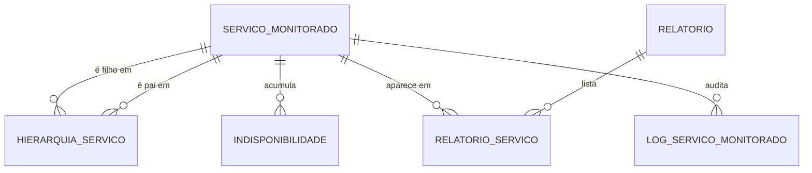

# Modelo de Dados — Monitoramento de Indisponibilidade

> Gerado em: 20/07/2026 | Versão: 1.1
> Schema: USU_INDISPONIBILIDADE | Tablespace Dados: USU_INDISPONIBILIDADE_D | Índices: USU_INDISPONIBILIDADE_I
> Referências: `docs/especificacao/escopo-geral/spec-functional.md`, `docs/escopo/escopo-geral/escopo.md`
> Normas: Administração de Dados TCE-MG v1.2

---

## Escopo e Decisões de Modelagem

- O **buffer de primeira falha** é mantido **exclusivamente em memória** (RN-2.4, RN-2.7) — **não** possui tabela. Apenas períodos **confirmados** (2ª falha consecutiva) são persistidos (RN-2.5, RN-2.8).
- **Parâmetros operacionais** (frequência de verificação, horário do relatório, limiar) ficam em **arquivo de configuração**, não no banco. O limiar aplicado é gravado como *snapshot* no relatório para rastreabilidade.
- **Cadastro de usuários e de sistemas do inventário** está **fora do escopo** (SSO / Portal de Serviços). O `COD_SISTEMA` guarda apenas a referência ao sistema no inventário externo. O **código do usuário** vem do token SSO no momento do acesso (RN-4.7) e **não** é persistido.
- Um serviço pode ter **múltiplos pais e múltiplos filhos** (RN-1.4, RN-3.2) → relacionamento N:M autorrelacionado resolvido pela tabela associativa `HIERARQUIA_SERVICO`.
- Inativação **remove** os vínculos e reativação pode **restaurá-los** (RN-1.6, RN-1.7) → vínculo usa *soft delete* (`IND_ATIVO`) para preservar a hierarquia anterior; a **remoção** definitiva (RN-1.8) apaga fisicamente os vínculos.
- Histórico de indisponibilidades é **sempre mantido** (RN-1.6, RN-1.8) — nunca apagado ao inativar/remover serviço.

### Bloco de Auditoria (obrigatório em toda tabela de negócio)

Todas as tabelas de negócio incluem, ao final, o mesmo conjunto de colunas de auditoria. A `LOG_SERVICO_MONITORADO` é a única exceção (é *append-only* e representa a própria trilha de auditoria).

| Coluna | Tipo Oracle | Obrig. | Descrição |
|--------|-------------|--------|-----------|
| NUM_CPF_USUARIO_CRIACAO | NUMBER(11) | Sim | CPF de quem criou o registro |
| NUM_CPF_USUARIO_ATUALIZACAO | NUMBER(11) | Não | CPF de quem atualizou |
| NUM_CPF_USUARIO_REMOCAO | NUMBER(11) | Não | CPF de quem removeu |
| DAT_CRIACAO | DATE | Sim | Data de criação (DEFAULT SYSDATE) |
| DAT_ATUALIZACAO | DATE | Não | Data da última atualização |
| DAT_REMOCAO | DATE | Não | Data de remoção lógica (soft delete) |

> Nas tabelas do modelo lógico abaixo, essas seis colunas ficam implícitas e não são repetidas linha a linha para reduzir ruído — estão explícitas no DDL.

---

## Modelo Conceitual

### Entidades

| Entidade | Descrição | Tipo |
|----------|-----------|------|
| SERVICO_MONITORADO | Serviço/sistema sob monitoramento de healthcheck | Fundamental |
| HIERARQUIA_SERVICO | Vínculo pai↔filho entre serviços | Associativa (autorrelacionada) |
| INDISPONIBILIDADE | Período confirmado de indisponibilidade de um serviço | Dependente |
| RELATORIO | Relatório diário gerado (por limiar ou do administrador) | Fundamental |
| RELATORIO_SERVICO | Sistemas incluídos em um relatório + total do dia | Associativa |
| LOG_SERVICO_MONITORADO | Auditoria de operações sobre serviços | Log |

### Relacionamentos

| De | Para | Cardinalidade | Descrição |
|----|------|---------------|-----------|
| SERVICO_MONITORADO | HIERARQUIA_SERVICO (filho) | 1:N | Serviço participa como filho em vínculos |
| SERVICO_MONITORADO | HIERARQUIA_SERVICO (pai) | 1:N | Serviço participa como pai em vínculos |
| SERVICO_MONITORADO | INDISPONIBILIDADE | 1:N | Serviço acumula vários períodos de indisponibilidade |
| RELATORIO | RELATORIO_SERVICO | 1:N | Relatório lista vários sistemas |
| SERVICO_MONITORADO | RELATORIO_SERVICO | 1:N | Serviço aparece em vários relatórios |
| SERVICO_MONITORADO | LOG_SERVICO_MONITORADO | 1:N | Serviço tem várias operações auditadas |

### DER Conceitual (Mermaid)

---

## Modelo Lógico

### SERVICO_MONITORADO
> Serviço/sistema incluído no monitoramento, com URL de healthcheck e ciclo de vida (Ativo/Inativo/Removido).

| Coluna | Tipo | Obrig. | Descrição |
|--------|------|--------|-----------|
| ID_SERVICO | Numérico (PK) | Sim | Identificador único do serviço |
| COD_SISTEMA | Alfanum. (UK) | Sim | Código do sistema no inventário do Portal de Serviços |
| SGL_SERVICO | Alfanum. | Sim | Sigla do serviço (ex.: E-TCE) |
| NOM_SERVICO | Texto | Sim | Nome por extenso do sistema |
| DSC_URL_HEALTHCHECK | Texto | Sim | URL do endpoint de healthcheck |
| SGL_STATUS | Char(1) | Sim | A=Ativo, I=Inativo, R=Removido |
| DAT_INCLUSAO | Data | Sim | Data de inclusão no monitoramento |
| *(+ bloco de auditoria)* | — | — | 6 colunas de auditoria descritas acima |

**Chaves:** PK: `ID_SERVICO` | UK: `COD_SISTEMA` | CK: `SGL_STATUS IN ('A','I','R')`

---

### HIERARQUIA_SERVICO
> Vínculo hierárquico N:M entre serviços. `IND_ATIVO='N'` preserva a hierarquia anterior de um serviço inativado para eventual restauração.

| Coluna | Tipo | Obrig. | Descrição |
|--------|------|--------|-----------|
| ID_HIERARQUIA | Numérico (PK) | Sim | Identificador único do vínculo |
| ID_SERVICO_FILHO | Numérico (FK) | Sim | Serviço filho |
| ID_SERVICO_PAI | Numérico (FK) | Sim | Serviço pai |
| IND_ATIVO | Char(1) | Sim | S=vínculo vigente, N=vínculo suspenso (serviço inativado) |
| DAT_CRIACAO | Data | Sim | Data de criação do vínculo |
| DAT_ALTERACAO | Data | Não | Data da última alteração |

**Chaves:** PK: `ID_HIERARQUIA` | FK: `ID_SERVICO_FILHO` → `SERVICO_MONITORADO`, `ID_SERVICO_PAI` → `SERVICO_MONITORADO` | UK: (`ID_SERVICO_FILHO`, `ID_SERVICO_PAI`) | CK: `ID_SERVICO_FILHO <> ID_SERVICO_PAI`, `IND_ATIVO IN ('S','N')`

---

### INDISPONIBILIDADE
> Período confirmado de indisponibilidade de um serviço. Persistido só após a 2ª falha consecutiva; `DAT_FIM` nulo = período aberto (em andamento).

| Coluna | Tipo | Obrig. | Descrição |
|--------|------|--------|-----------|
| ID_INDISPONIBILIDADE | Numérico (PK) | Sim | Identificador único do período |
| ID_SERVICO | Numérico (FK) | Sim | Serviço indisponível |
| DAT_INICIO | Data (com hora) | Sim | Início (horário da primeira falha) |
| DAT_FIM | Data (com hora) | Não | Fim do período; nulo se em andamento |
| NUM_DURACAO_MIN | Numérico | Não | Duração em minutos; calculado no fechamento |
| *(+ bloco de auditoria)* | — | — | 6 colunas de auditoria descritas acima |

**Chaves:** PK: `ID_INDISPONIBILIDADE` | FK: `ID_SERVICO` → `SERVICO_MONITORADO` | CK: `DAT_FIM IS NULL OR DAT_FIM >= DAT_INICIO`

---

### RELATORIO
> Relatório diário gerado à meia-noite. Tipo L=por limiar (usuário, com código verificador) e A=diário do administrador (sem código verificador).

| Coluna | Tipo | Obrig. | Descrição |
|--------|------|--------|-----------|
| ID_RELATORIO | Numérico (PK) | Sim | Identificador único do relatório |
| DAT_REFERENCIA | Data | Sim | Dia de referência do relatório |
| SGL_TIPO | Char(1) | Sim | L=Por Limiar, A=Diário Administrador |
| COD_VERIFICADOR | Alfanum. (UK) | Não | Código verificador único (apenas tipo L) |
| NUM_LIMIAR_MIN | Numérico | Não | Limiar aplicado em minutos (snapshot; apenas tipo L) |
| IND_PARCIAL | Char(1) | Sim | S=parcial/em andamento, N=fechado |
| SGL_STATUS | Char(1) | Sim | C=Concluído, P=Parcial, E=Erro |
| DAT_GERACAO | Data | Sim | Data/hora da geração |
| *(+ bloco de auditoria)* | — | — | 6 colunas de auditoria descritas acima |

**Chaves:** PK: `ID_RELATORIO` | UK: `COD_VERIFICADOR` | CK: `SGL_TIPO IN ('L','A')`, `IND_PARCIAL IN ('S','N')`, `SGL_STATUS IN ('C','P','E')`

---

### RELATORIO_SERVICO
> Sistemas incluídos em um relatório, com o total acumulado do dia (snapshot). Os períodos individuais exibidos são derivados de INDISPONIBILIDADE pela data de referência.

| Coluna | Tipo | Obrig. | Descrição |
|--------|------|--------|-----------|
| ID_RELATORIO_SERVICO | Numérico (PK) | Sim | Identificador único |
| ID_RELATORIO | Numérico (FK) | Sim | Relatório de origem |
| ID_SERVICO | Numérico (FK) | Sim | Serviço incluído |
| NUM_TOTAL_MIN | Numérico | Sim | Total acumulado de indisponibilidade no dia (minutos) |
| *(+ bloco de auditoria)* | — | — | 6 colunas de auditoria descritas acima |

**Chaves:** PK: `ID_RELATORIO_SERVICO` | FK: `ID_RELATORIO` → `RELATORIO`, `ID_SERVICO` → `SERVICO_MONITORADO` | UK: (`ID_RELATORIO`, `ID_SERVICO`)

---

### LOG_SERVICO_MONITORADO
> Auditoria de inclusões, alterações e remoções de serviços (via trigger).

| Coluna | Tipo | Obrig. | Descrição |
|--------|------|--------|-----------|
| ID_LOG | Numérico (PK) | Sim | Identificador único do log |
| ID_SERVICO | Numérico | Sim | Serviço afetado |
| SGL_OPERACAO | Char(1) | Sim | I=Insert, U=Update, D=Delete |
| DAT_OPERACAO | Data | Sim | Data/hora da operação |

**Chaves:** PK: `ID_LOG` | CK: `SGL_OPERACAO IN ('I','U','D')`

---

## Checklist de Conformidade TCE-MG

### Tabelas
- [x] Nome no singular, sem acento, sem preposição
- [x] Prefixo correto conforme tipo (LOG_ aplicado; associativas nomeadas por relação)
- [x] Tamanho ≤ 30 caracteres (todos os objetos derivados verificados)
- [x] `COMMENT ON TABLE` preenchido no DDL

### Colunas
- [x] Todas com prefixo de categoria (ID_, COD_, SGL_, NOM_, DSC_, DAT_, NUM_, IND_)
- [x] Nome reflete significado de negócio
- [x] `COMMENT ON COLUMN` preenchido para todas

### Constraints e Índices
- [x] PK → `PK_NomeDaTabela`
- [x] FK → `FK_...` + índice `IX_FK_` criado
- [x] UK → `UK_NomeDaTabela`
- [x] CK → `CK_NomeDaTabela_NNN`
- [x] Sequence `SQ_` criada para toda coluna `ID_`

### Tablespace
- [x] Tabelas em `USU_INDISPONIBILIDADE_D`
- [x] Índices em `USU_INDISPONIBILIDADE_I`

### Auditoria
- [x] Bloco de auditoria (CPF criação/atualização/remoção + datas) em todas as tabelas de negócio
- [x] Exceção documentada: `LOG_SERVICO_MONITORADO` (append-only)

---

## Pontos a Refinar

- [ ] **Retenção/particionamento de INDISPONIBILIDADE e LOG_SERVICO_MONITORADO** — avaliar particionamento RANGE por mês caso o volume histórico cresça para dezenas de milhões de registros.
- [ ] **UK de RELATORIO por (DAT_REFERENCIA, SGL_TIPO)** para o relatório fechado — decidir política quando há regeração de parciais no mesmo dia.
- [ ] **CPF como NUMBER(11)** — segue o exemplo `NUM_CPF_CNPJ` das normas TCE-MG; a formatação com zeros à esquerda é responsabilidade da aplicação. Avaliar com a AD se preferem `VARCHAR2(11)`.
