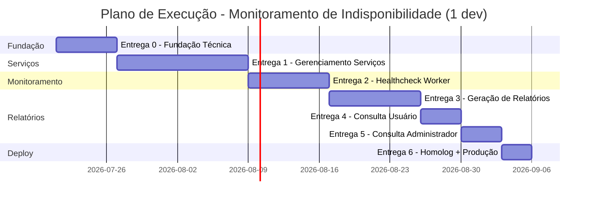

# Plano de Execução: [FEATURE] [INDISP] - Monitoramento de Indisponibilidade

## Metadados
| Campo | Valor |
|-------|-------|
| **Especificação** | `docs/especificacao/escopo-geral/spec-functional.md` |
| **Escopo** | `docs/escopo/escopo-geral/escopo.md` |
| **Modelo de Dados** | `docs/data-modeling/` (schema `USU_INDISPONIBILIDADE`) |
| **Autor** | Bruno |
| **Data** | 2026-07-20 |
| **Status** | Rascunho |
| **Versão** | 1.0 |

---

## Resumo Executivo

### Objetivo
Implementar o sistema de Monitoramento de Indisponibilidade do TCE-MG: verificação periódica de healthchecks, registro preciso de períodos de indisponibilidade (sem falsos positivos via buffer de 2 falhas), hierarquia entre serviços e geração/consulta de relatórios autenticáveis (por limiar e diário do administrador). Backend .NET (Clean Architecture + Worker + Oracle 19c) e dois frontends Angular (Portal Administrativo e consulta do Usuário, publicada de forma independente).

### Escopo

**Incluído (7 features da spec):**
- F1 — Gerenciamento de Serviços Monitorados (CRUD + ciclo de vida)
- F2 — Monitoramento de Healthcheck (worker + buffer + persistência)
- F3 — Hierarquia de Serviços (vínculos N:M + exibição em relatórios)
- F4 — Relatório por Limiar (job diário + PDF/QR)
- F5 — Relatório Diário do Administrador (+ parcial sob demanda)
- F6 — Consulta de Relatórios do Usuário (projeto Angular independente)
- F7 — Consulta de Relatórios do Administrador

**Não incluído (fora do escopo — spec/escopo):**
- Cadastro/gestão de usuários e autenticação (responsabilidade do SSO)
- Cadastro de sistemas no inventário (responsabilidade do Portal de Serviços — consumido via API)
- Dashboard em tempo real estilo Grafana (mantida apenas compatibilidade via camada de observabilidade desacoplada)

### Premissas
- **Time:** 1 desenvolvedor fullstack (.NET + Angular). Estimativas em horas; dias calculados a ~6h úteis/dia.
- **Estado Angular:** BehaviorSubject (services de estado). Migração para NgRx só em refactoring planejado, se necessário.
- **Banco:** Oracle 19c, schema `USU_INDISPONIBILIDADE` conforme modelo já definido.
- **Configuração:** frequência de verificação (1 min) e horário do relatório (meia-noite) e limiar (120 min) via `appsettings`, sem redeploy.

### Métricas de Sucesso (do escopo)
- 100% dos sistemas cadastrados sendo monitorados; detecção ≤ 1 minuto.
- Relatório diário gerado corretamente por 5 dias consecutivos em homologação.
- QR Code de validação funcionando em 100% dos relatórios.
- Hierarquia propagando/exibindo corretamente; 0% de falha na geração de relatórios.

---

## Visão Geral das Entregas

| # | Entrega | Features | Descrição | Estimativa | Dependência |
|---|---------|----------|-----------|------------|-------------|
| 0 | Fundação Técnica | — | Solução Clean Architecture, DbContext Oracle, SSO/auth, log tribunal, esqueleto dos 2 apps Angular | ~6d | - |
| 1 | Gerenciamento de Serviços | F1, F3 (vínculos) | CRUD + ciclo de vida + integração inventário Portal + tela admin | ~13d | Entrega 0 |
| 2 | Monitoramento de Healthcheck | F2, F3 (independência) | Worker de verificação, buffer em memória, persistência de períodos | ~8d | Entrega 1 |
| 3 | Geração de Relatórios | F4, F5 | Jobs diários, relatório por limiar + diário admin, PDF/QR, parcial | ~9d | Entrega 2 |
| 4 | Consulta do Usuário | F6 | Projeto Angular independente + endpoint de consulta d-1 + download PDF | ~4d | Entrega 3 |
| 5 | Consulta do Administrador | F7 | Tela admin de consulta + hierarquia + relatório parcial | ~4d | Entrega 3 |
| 6 | Homologação e Produção | — | Deploy API+Worker+2 frontends, validação go-live, produção | ~3d | Entregas 1-5 |

**Estimativa Total:** ~47 dias (~268h)
**Buffer (20%):** ~9 dias
**Total com Buffer:** ~56 dias (~11 semanas com 1 dev)

> Entregas 4 e 5 são independentes entre si (ambas dependem só da Entrega 3) e podem ser reordenadas.

---

## Entrega 0: Fundação Técnica

### Objetivo
Preparar toda a base técnica para que as features subsequentes só precisem adicionar Domain→Application→Presentation e componentes Angular, sem retrabalho de infraestrutura.

### Pré-requisitos
- Confirmação da sigla/schema Oracle (`USU_INDISPONIBILIDADE`) — **OK**.
- Acesso ao endpoint de inventário do Portal, ao SSO e ao sistema de log do tribunal (envolver Segurança/Infra — dependência do escopo).

### Tarefas

#### Backend — Estrutura e Infra
| ID | Título do Item | Tipo | Skill | Est. |
|----|----------------|------|-------|------|
| 0.1 | [HT] [CORE] - Criar solução .NET Clean Architecture (Domain, Application, Infrastructure, Presentation/API, Worker) | Estrutura | `dotnet-clean-architecture` | 4h |
| 0.2 | [HT] [CORE] - Configurar DbContext Oracle 19c (connection, mapeamento tablespaces `USU_INDISPONIBILIDADE_D/_I`) | EF Config | `dotnet-infrastructure-repository` | 3h |
| 0.3 | [HT] [CORE] - Criar `RepositoryBase` + `UnitOfWork` | Infra | `dotnet-infrastructure-repository` | 3h |
| 0.4 | [HT] [CORE] - Configurar MediatR + pipeline behaviors (validação, logging) | Application | `dotnet-application-feature` | 2h |
| 0.5 | [HT] [CORE] - Configurar autenticação SSO (JWT) + policy `PRT_SRV_ADMINISTRADORES` (claim `listaGruposSistema`) | Auth | `dotnet-external-service` | 4h |
| 0.6 | [HT] [CORE] - Criar adapter de envio ao sistema de log do tribunal | Integração | `dotnet-external-service` | 3h |
| 0.7 | [HT] [CORE] - Criar migration inicial com todas as tabelas do modelo de dados | Migration | - | 2h |

#### Frontend — Esqueleto dos dois apps
| ID | Título do Item | Tipo | Est. |
|----|----------------|------|------|
| 0.8 | [HT] [ADMIN] - Criar projeto Angular Portal Administrativo + estrutura Core/Shared | Setup | 4h |
| 0.9 | [HT] [USUARIO] - Criar projeto Angular independente (consulta do Usuário), deploy separado | Setup | 3h |
| 0.10 | [HT] [CORE] - Criar `AuthInterceptor` (JWT) + `AuthGuard` (SSO) nos dois projetos | Interceptor/Guard | 4h |
| 0.11 | [HT] [CORE] - Configurar `environment` (homolog/prod) + `HttpErrorInterceptor` global | Config | 2h |

### Subtotal Entrega 0
| Categoria | Estimativa |
|-----------|------------|
| Backend | 21h |
| Frontend | 13h |
| **Total** | **34h (~6 dias)** |

### Critérios de Aceite
- [ ] Solução compila e sobe API + Worker vazios; Swagger acessível.
- [ ] Migration aplica o schema `USU_INDISPONIBILIDADE` completo no Oracle 19c.
- [ ] Autenticação SSO validando token e distinguindo perfil Administrador.
- [ ] Dois projetos Angular sobem com guard/interceptor configurados.

---

## Entrega 1: Gerenciamento de Serviços Monitorados (F1 + vínculos de F3)

### Objetivo
Administrador inclui, edita, inativa, reativa e remove serviços monitorados — com validação de URL de healthcheck, integração com o inventário do Portal e gestão de vínculos hierárquicos — via tela no Portal Administrativo.

### Tarefas

#### Domain Layer
| ID | Título do Item | Tipo | Skill | Est. |
|----|----------------|------|-------|------|
| 1.1 | [TASK] Desenvolver - [SERVICO] - Criar Value Object `UrlHealthcheck` (validação de formato) | ValueObject | `dotnet-domain-entity` | 2h |
| 1.2 | [TASK] Desenvolver - [SERVICO] - Criar entidade `ServicoMonitorado` (status A/I/R, inativar/reativar/remover, editar URL) | Entity | `dotnet-domain-entity` | 4h |
| 1.3 | [TASK] Desenvolver - [SERVICO] - Criar associação `HierarquiaServico` (vínculo N:M, soft delete) | Entity | `dotnet-domain-entity` | 3h |
| 1.4 | [TASK] Desenvolver - [SERVICO] - Criar interfaces `IServicoMonitoradoRepository`, `IHierarquiaServicoRepository` | Interface | `dotnet-domain-entity` | 1h |

#### Infrastructure Layer
| ID | Título do Item | Tipo | Skill | Est. |
|----|----------------|------|-------|------|
| 1.5 | [HT] [SERVICO] - Criar EF Configurations (`ServicoMonitorado`, `HierarquiaServico`) | EF Config | - | 2h |
| 1.6 | [TASK] Desenvolver - [SERVICO] - Criar repositórios de serviço e hierarquia | Repository | `dotnet-infrastructure-repository` | 3h |
| 1.7 | [TASK] Desenvolver - [SERVICO] - Criar adapter de inventário do Portal (GET sistemas disponíveis, resiliência) | Integração | `dotnet-external-service` | 6h |

#### Application Layer
| ID | Título do Item | Tipo | Skill | Est. |
|----|----------------|------|-------|------|
| 1.8 | [TASK] Desenvolver - [SERVICO] - Criar `ServicoDto` e `HierarquiaDto` | DTO | `dotnet-application-feature` | 1h |
| 1.9 | [TASK] Desenvolver - [SERVICO] - Criar `IncluirServicoCommand` (valida URL via healthcheck, cria vínculos) | Command | `dotnet-application-feature` | 5h |
| 1.10 | [TASK] Desenvolver - [SERVICO] - Criar `EditarServicoCommand` (URL + vínculos) | Command | `dotnet-application-feature` | 3h |
| 1.11 | [TASK] Desenvolver - [SERVICO] - Criar `InativarServicoCommand` (remove vínculos, mantém histórico) | Command | `dotnet-application-feature` | 3h |
| 1.12 | [TASK] Desenvolver - [SERVICO] - Criar `ReativarServicoCommand` (restaurar hierarquia opcional) | Command | `dotnet-application-feature` | 3h |
| 1.13 | [TASK] Desenvolver - [SERVICO] - Criar `RemoverServicoCommand` (soft delete + elimina vínculos) | Command | `dotnet-application-feature` | 2h |
| 1.14 | [TASK] Desenvolver - [SERVICO] - Criar `GetServicosMonitoradosQuery` | Query | `dotnet-application-feature` | 2h |
| 1.15 | [TASK] Desenvolver - [SERVICO] - Criar `GetSistemasDisponiveisQuery` (inventário menos incluídos; vazio se inventário indisponível) | Query | `dotnet-application-feature` | 2h |

#### Presentation Layer
| ID | Título do Item | Tipo | Skill | Est. |
|----|----------------|------|-------|------|
| 1.16 | [TASK] Desenvolver - [SERVICO] - Criar `ServicosController` (CRUD + ações de ciclo de vida) | Controller | `dotnet-endpoint-generator` | 4h |
| 1.17 | [TASK] Desenvolver - [SERVICO] - Criar request validators (URL obrigatória, formato) | Validator | `dotnet-endpoint-generator` | 2h |

#### Frontend — Core / Shared (ADMIN)
| ID | Título do Item | Tipo | Est. |
|----|----------------|------|------|
| 1.18 | [TASK] Desenvolver - [ADMIN] - Criar models `Servico`, `Hierarquia`, `SistemaInventario` | Interface TS | 1h |
| 1.19 | [TASK] Desenvolver - [ADMIN] - Criar `ServicoService` (HttpClient: CRUD + ações) | Service | 3h |
| 1.20 | [TASK] Desenvolver - [ADMIN] - Criar `ServicoStateService` (BehaviorSubject) | State Service | 2h |

#### Frontend — Feature Module (ADMIN)
| ID | Título do Item | Tipo | Est. |
|----|----------------|------|------|
| 1.21 | [TASK] Desenvolver - [ADMIN] - Criar `servicos.module.ts` + rota lazy `/servicos` | Module/Routing | 1h |
| 1.22 | [TASK] Desenvolver - [ADMIN] - Criar `ServicoListComponent` (Smart) | Component | 3h |
| 1.23 | [TASK] Desenvolver - [ADMIN] - Criar `ServicoFormComponent` (Reactive Form: URL, seleção de pais, status) | Form | 5h |
| 1.24 | [TASK] Desenvolver - [ADMIN] - Criar `HierarquiaSelectorComponent` (Presentational, OnPush) | Component | 2h |

#### Testes
| ID | Título do Item | Tipo | Est. |
|----|----------------|------|------|
| 1.25 | [TASK] Testar - [SERVICO] - Testes unitários Domain (entidade, VO, ciclo de vida) | Unit (.NET) | 3h |
| 1.26 | [TASK] Testar - [SERVICO] - Testes unitários Handlers (incluir/editar/inativar/reativar/remover) | Unit (.NET) | 4h |
| 1.27 | [TASK] Testar - [ADMIN] - Testes unitários `ServicoService` + `ServicoFormComponent` | Unit (Angular) | 3h |
| 1.28 | [TASK] Testar - [SERVICO] - Testes de integração API (CRUD + inventário mock) | Integration | 2h |

### Subtotal Entrega 1
| Categoria | Estimativa |
|-----------|------------|
| Backend | 48h |
| Frontend | 17h |
| Testes | 12h |
| **Total** | **77h (~13 dias)** |

### Critérios de Aceite
- [ ] Incluir serviço com URL válida (200-204) → status Ativo; URL inválida/500 → rejeitado com mensagem (Cenários 1.1-1.3).
- [ ] Inventário indisponível → lista de disponíveis vazia (Cenário 1.4).
- [ ] Editar URL e vínculos; inativar remove vínculos e mantém histórico; reativar com/sem restaurar hierarquia; remover elimina vínculos (Cenários 1.5-1.8).
- [ ] Tela admin integrada à API real; cobertura > 80%.

---

## Entrega 2: Monitoramento de Healthcheck (F2 + independência de F3)

### Objetivo
Worker verifica periodicamente os endpoints dos serviços Ativos, confirma indisponibilidade com 2 falhas consecutivas via buffer em memória e persiste apenas períodos confirmados — cada serviço de forma independente. Sem interface (backend/worker).

### Tarefas

#### Domain Layer
| ID | Título do Item | Tipo | Skill | Est. |
|----|----------------|------|-------|------|
| 2.1 | [TASK] Desenvolver - [MONITOR] - Criar entidade `Indisponibilidade` (abrir/fechar período, calcular duração) | Entity | `dotnet-domain-entity` | 4h |
| 2.2 | [TASK] Desenvolver - [MONITOR] - Criar `BufferFalha` (estado em memória: 1ª falha, marcação de gravação) | Domain Service | `dotnet-domain-entity` | 3h |
| 2.3 | [TASK] Desenvolver - [MONITOR] - Criar interface `IIndisponibilidadeRepository` | Interface | `dotnet-domain-entity` | 0.5h |

#### Infrastructure Layer
| ID | Título do Item | Tipo | Skill | Est. |
|----|----------------|------|-------|------|
| 2.4 | [HT] [MONITOR] - Criar EF Config + repositório `Indisponibilidade` | Repository | `dotnet-infrastructure-repository` | 3h |
| 2.5 | [TASK] Desenvolver - [MONITOR] - Criar `HealthcheckClient` (HTTP: aceita 200-204; timeout/DNS/host = indisponível) | Integração | `dotnet-external-service` | 6h |
| 2.6 | [HT] [MONITOR] - Criar adapter de observabilidade desacoplado (compatível Prometheus) | Integração | `dotnet-external-service` | 4h |

#### Application Layer
| ID | Título do Item | Tipo | Skill | Est. |
|----|----------------|------|-------|------|
| 2.7 | [TASK] Desenvolver - [MONITOR] - Criar `VerificarHealthchecksCommand` + Handler (ciclo, buffer, 1ª/2ª falha, persistência) | Command | `dotnet-application-feature` | 8h |
| 2.8 | [TASK] Desenvolver - [MONITOR] - Criar `FecharPeriodoCommand` (recuperação → fecha período + limpa buffer) | Command | `dotnet-application-feature` | 3h |

#### Worker / Presentation
| ID | Título do Item | Tipo | Skill | Est. |
|----|----------------|------|-------|------|
| 2.9 | [HT] [MONITOR] - Criar `HealthcheckWorker` (BackgroundService, timer configurável — padrão 1 min) | Worker | - | 4h |
| 2.10 | [HT] [MONITOR] - Configurar frequência e tratamento de exceção → log do tribunal | Config | - | 1h |

#### Testes
| ID | Título do Item | Tipo | Est. |
|----|----------------|------|------|
| 2.11 | [TASK] Testar - [MONITOR] - Testes unitários Domain (`Indisponibilidade`, `BufferFalha`) | Unit (.NET) | 3h |
| 2.12 | [TASK] Testar - [MONITOR] - Testes de Handler cobrindo Cenários 2.1-2.8 (buffer, persistência, recuperação, restart, erro de banco) | Unit (.NET) | 5h |
| 2.13 | [TASK] Testar - [MONITOR] - Testes de integração (endpoints mock: 503, timeout, 200) | Integration | 2h |

### Subtotal Entrega 2
| Categoria | Estimativa |
|-----------|------------|
| Backend | 36h |
| Testes | 10h |
| **Total** | **46h (~8 dias)** |

### Critérios de Aceite
- [ ] 1ª falha cria buffer sem persistir; 2ª falha persiste início; recuperação fecha período e limpa buffer (Cenários 2.1-2.4).
- [ ] Erro de conexão tratado como indisponibilidade; serviços Inativo/Removido não verificados (Cenários 2.5-2.6).
- [ ] Restart zera o buffer; falha de persistência gera exceção ao log do tribunal (Cenários 2.7-2.8).
- [ ] Pai e filho registram períodos independentes; recuperação independente (Cenários 3.1-3.2).
- [ ] Detecção ≤ 1 minuto confirmada.

---

## Entrega 3: Geração de Relatórios (F4 + F5)

### Objetivo
Ao final do dia (meia-noite configurável), gerar automaticamente o relatório por limiar (usuário, com código verificador e QR) e o relatório diário do administrador (todos os sistemas, com hierarquia). Administrador pode gerar relatório parcial do dia atual.

### Tarefas

#### Domain Layer
| ID | Título do Item | Tipo | Skill | Est. |
|----|----------------|------|-------|------|
| 3.1 | [TASK] Desenvolver - [RELATORIO] - Criar entidades `Relatorio` e `RelatorioServico` (tipos L/A, parcial, status) | Entity | `dotnet-domain-entity` | 5h |
| 3.2 | [TASK] Desenvolver - [RELATORIO] - Criar Value Object `CodigoVerificador` (único por relatório de limiar) | ValueObject | `dotnet-domain-entity` | 2h |
| 3.3 | [TASK] Desenvolver - [RELATORIO] - Criar interface `IRelatorioRepository` | Interface | `dotnet-domain-entity` | 0.5h |

#### Infrastructure Layer
| ID | Título do Item | Tipo | Skill | Est. |
|----|----------------|------|-------|------|
| 3.4 | [HT] [RELATORIO] - Criar EF Config + repositório `Relatorio`/`RelatorioServico` | Repository | `dotnet-infrastructure-repository` | 3h |
| 3.5 | [TASK] Desenvolver - [RELATORIO] - Criar serviço de geração de PDF + QR Code (cabeçalho, tabela de períodos, total, códigos) | Integração | `dotnet-external-service` | 8h |

#### Application Layer
| ID | Título do Item | Tipo | Skill | Est. |
|----|----------------|------|-------|------|
| 3.6 | [TASK] Desenvolver - [RELATORIO] - Criar `GerarRelatorioLimiarCommand` (soma diária ≥ limiar; nada se ninguém atinge) | Command | `dotnet-application-feature` | 5h |
| 3.7 | [TASK] Desenvolver - [RELATORIO] - Criar `GerarRelatorioDiarioAdminCommand` (todos com indisponibilidade + hierarquia) | Command | `dotnet-application-feature` | 5h |
| 3.8 | [TASK] Desenvolver - [RELATORIO] - Criar `GerarRelatorioParcialCommand` (dia atual, indicação "em andamento") | Command | `dotnet-application-feature` | 3h |
| 3.9 | [TASK] Desenvolver - [RELATORIO] - Criar queries de obtenção de relatório por data | Query | `dotnet-application-feature` | 3h |

#### Worker / Presentation
| ID | Título do Item | Tipo | Skill | Est. |
|----|----------------|------|-------|------|
| 3.10 | [HT] [RELATORIO] - Criar `FechamentoDiarioWorker` (BackgroundService à meia-noite configurável) | Worker | - | 4h |
| 3.11 | [TASK] Desenvolver - [RELATORIO] - Criar `RelatoriosController` (gerar parcial, obter) | Controller | `dotnet-endpoint-generator` | 3h |

#### Testes
| ID | Título do Item | Tipo | Est. |
|----|----------------|------|------|
| 3.12 | [TASK] Testar - [RELATORIO] - Testes unitários Domain + geração de código verificador | Unit (.NET) | 3h |
| 3.13 | [TASK] Testar - [RELATORIO] - Testes de Handler (Cenários 4.1-4.5 e 5.1-5.4: limiar, soma não-contínua, parcial, falha) | Unit (.NET) | 6h |
| 3.14 | [TASK] Testar - [RELATORIO] - Testes de integração (geração PDF/QR + snapshot) | Integration | 3h |

### Subtotal Entrega 3
| Categoria | Estimativa |
|-----------|------------|
| Backend | 39h |
| Testes | 12h |
| **Total** | **51h (~9 dias)** |

### Critérios de Aceite
- [ ] Limiar 120 min: inclui ≥ limiar, exclui abaixo; soma de períodos não contínuos (Cenários 4.1-4.2).
- [ ] Nenhum atinge limiar → sem relatório; código do usuário no QR conforme quem acessa; falha → exceção ao log (Cenários 4.3-4.5).
- [ ] Relatório diário inclui todos (inclusive abaixo do limiar) com hierarquia, sem código verificador/usuário; parcial "em andamento" com período aberto (Cenários 5.1-5.4).
- [ ] QR Code válido em 100% dos relatórios.

---

## Entrega 4: Consulta de Relatórios do Usuário (F6)

### Objetivo
Usuário autenticado no Portal de Serviços consulta o relatório por limiar por data, em projeto Angular publicado de forma independente, com download de PDF.

### Tarefas

#### Backend
| ID | Título do Item | Tipo | Skill | Est. |
|----|----------------|------|-------|------|
| 4.1 | [TASK] Desenvolver - [RELATORIO] - Criar `GetRelatorioLimiarPorDataQuery` (d-1; futura/atual → indisponível) | Query | `dotnet-application-feature` | 3h |
| 4.2 | [TASK] Desenvolver - [RELATORIO] - Criar endpoint de consulta do Usuário + download de PDF | Controller | `dotnet-endpoint-generator` | 3h |

#### Frontend — App do Usuário (independente)
| ID | Título do Item | Tipo | Est. |
|----|----------------|------|------|
| 4.3 | [TASK] Desenvolver - [USUARIO] - Criar models + `RelatorioUsuarioService` (HttpClient GET) | Service | 2.5h |
| 4.4 | [TASK] Desenvolver - [USUARIO] - Criar `consulta.module.ts` + rota lazy | Module/Routing | 1h |
| 4.5 | [TASK] Desenvolver - [USUARIO] - Criar `ConsultaRelatorioComponent` (Smart: seletor de data, mensagens de ausência/data inválida) | Component | 4h |
| 4.6 | [TASK] Desenvolver - [USUARIO] - Criar `RelatorioViewComponent` (Presentational + botão "Baixar PDF") | Component | 3h |
| 4.7 | [TASK] Desenvolver - [USUARIO] - Configurar `AuthGuard` (não autenticado → login do Portal) | Guard | 1h |

#### Testes
| ID | Título do Item | Tipo | Est. |
|----|----------------|------|------|
| 4.8 | [TASK] Testar - [USUARIO] - Testes unitários service + component (datas, ausência, download) | Unit (Angular) | 4h |
| 4.9 | [TASK] Testar - [RELATORIO] - Testes de integração da query por data | Integration | 2h |

### Subtotal Entrega 4
| Categoria | Estimativa |
|-----------|------------|
| Backend | 6h |
| Frontend | 11.5h |
| Testes | 6h |
| **Total** | **23.5h (~4 dias)** |

### Critérios de Aceite
- [ ] Consulta d-1 exibe só sistemas do limiar, sem hierarquia; data sem indisponibilidade mostra mensagem (Cenários 6.1-6.2).
- [ ] Data futura/atual → "sem relatório disponível"; não autenticado → login (Cenários 6.3-6.4).
- [ ] Botão "Baixar PDF" disponível no relatório d-1 concluído (Cenário 6.5).
- [ ] App publicado/deployável de forma independente (RN-6.1).

---

## Entrega 5: Consulta de Relatórios do Administrador (F7)

### Objetivo
Administrador (claim `PRT_SRV_ADMINISTRADORES`) consulta relatórios por data no Portal Administrativo, com hierarquia, download de PDF e geração/baixa de relatório parcial do dia atual.

### Tarefas

#### Backend
| ID | Título do Item | Tipo | Skill | Est. |
|----|----------------|------|-------|------|
| 5.1 | [TASK] Desenvolver - [RELATORIO] - Criar `GetRelatorioAdminPorDataQuery` (todos + hierarquia; d-1 e histórico) | Query | `dotnet-application-feature` | 3h |
| 5.2 | [TASK] Desenvolver - [RELATORIO] - Criar endpoint de consulta do Admin + parcial + download | Controller | `dotnet-endpoint-generator` | 3h |

#### Frontend — Portal Administrativo
| ID | Título do Item | Tipo | Est. |
|----|----------------|------|------|
| 5.3 | [TASK] Desenvolver - [ADMIN] - Criar `RelatorioAdminService` (HttpClient GET + parcial) | Service | 2h |
| 5.4 | [TASK] Desenvolver - [ADMIN] - Criar módulo + rota lazy de consulta admin | Module/Routing | 1h |
| 5.5 | [TASK] Desenvolver - [ADMIN] - Criar `ConsultaAdminComponent` (Smart: data, hierarquia, botão "Gerar Parcial") | Component | 4h |
| 5.6 | [TASK] Desenvolver - [ADMIN] - Criar `RelatorioAdminViewComponent` (Presentational: hierarquia, "Baixar PDF"/"Baixar Parcial") | Component | 3h |
| 5.7 | [TASK] Desenvolver - [ADMIN] - Configurar `AdminGuard` (claim `PRT_SRV_ADMINISTRADORES`) | Guard | 1h |

#### Testes
| ID | Título do Item | Tipo | Est. |
|----|----------------|------|------|
| 5.8 | [TASK] Testar - [ADMIN] - Testes unitários service + component (perfil, hierarquia, parcial) | Unit (Angular) | 4h |
| 5.9 | [TASK] Testar - [RELATORIO] - Testes de integração da query admin | Integration | 2h |

### Subtotal Entrega 5
| Categoria | Estimativa |
|-----------|------------|
| Backend | 6h |
| Frontend | 11h |
| Testes | 6h |
| **Total** | **23h (~4 dias)** |

### Critérios de Aceite
- [ ] Consulta d-1 exibe todos os sistemas com hierarquia; data sem indisponibilidade mostra mensagem (Cenários 7.1-7.2).
- [ ] Não autenticado → login; "Baixar PDF" no d-1; "Gerar/Baixar Parcial" no dia atual "em andamento" (Cenários 7.3-7.5).
- [ ] Acesso restrito ao perfil `PRT_SRV_ADMINISTRADORES`.

---

## Entrega 6: Homologação e Produção

### Objetivo
Publicar API + Worker + os dois frontends em homologação, validar os critérios de go-live e promover para produção.

### Tarefas
| ID | Título do Item | Tipo | Skill | Est. |
|----|----------------|------|-------|------|
| 6.1 | [HT] [DEVOPS] - Deploy da API + Worker em homologação | Deploy | `dotnet-deploy-homolog` | 3h |
| 6.2 | [HT] [DEVOPS] - Deploy dos frontends Angular (Admin + Usuário) em homologação | Deploy | - | 2h |
| 6.3 | [TASK] Testar - [GO-LIVE] - Validação: relatório diário por 5 dias, QR, limiar 2h, detecção ≤1min, hierarquia | Validação | - | 4h |
| 6.4 | [HT] [DEVOPS] - Deploy em produção (API + Worker + frontends) | Deploy | `dotnet-deploy-prod` | 3h |

### Subtotal Entrega 6
| Categoria | Estimativa |
|-----------|------------|
| **Total** | **12h (~2-3 dias)** |

### Critérios de Aceite (Go-live — do escopo)
- [ ] 100% dos sistemas do Portal sendo monitorados.
- [ ] Relatório diário correto por 5 dias consecutivos em homologação.
- [ ] Relatório por limiar (2h) correto ao simular indisponibilidade.
- [ ] QR Code funcionando em 100% dos relatórios; detecção ≤ 1 min; hierarquia correta.
- [ ] Conformidade com a minuta do Tribunal confirmada.

---

## Cronograma (Mermaid)

---

## Riscos e Mitigações

| Risco | Prob. | Impacto | Mitigação |
|-------|-------|---------|-----------|
| Inventário do Portal / SSO indisponíveis ou instáveis | Média | Alto | Adapter com resiliência (retry/timeout); lista vazia como fallback (RN-1.4) |
| Formato de resposta ASP.NET HealthChecks vs Spring Actuator divergente | Média | Alto | Spike técnico (hipótese T4 do escopo) antes da Entrega 2 |
| Formato do relatório/QR não aceito pelo Tribunal | Média | Alto | Validar minuta (hipóteses U4/N1) antes da Entrega 3 |
| Buffer em memória perde estado em restart | Baixa | Médio | Comportamento esperado por design (RN-2.7); reinício reinicia ciclo |
| Geração de PDF/QR mais complexa que estimado | Média | Médio | Isolar em adapter; prototipar cedo (protótipos PDF já existem em `docs/protótipos/relatorio-pdf/`) |
| 1 dev = caminho crítico longo (~11 semanas) | Alta | Médio | Entregas 4 e 5 reordenáveis; possível paralelizar se entrar 2º dev |

---

## Dependências Externas

| Dependência | Responsável | Necessária em |
|-------------|-------------|---------------|
| Endpoint de inventário do Portal de Serviços | Time do Portal | Entrega 1 |
| SSO (token JWT + claim de perfil) | Time de Segurança | Entrega 0 |
| Sistema de log do tribunal | Infra/DTI | Entrega 0 |
| Liberação de acesso aos endpoints internos | Segurança e Infra | Entrega 2 |
| Validação da minuta e do formato de relatório | Tribunal | Entrega 3 |
| Ambientes de homolog e produção | DevOps | Entrega 6 |

---

## Definição de Pronto (DoD)

**Tarefa pronta:** código funcionando localmente, testes unitários (>80%), integração quando aplicável, code review aprovado, sem novos débitos técnicos.

**Entrega pronta:** todas as tarefas backend validadas via Swagger, frontend integrado à API real, critérios de aceite verificados, deploy em homolog OK, regressão passando.

---

## Histórico de Revisões

| Versão | Data | Autor | Descrição |
|--------|------|-------|-----------|
| 1.0 | 2026-07-20 | Bruno / Claude | Versão inicial — 7 features em 7 entregas (0-6), 1 dev fullstack, BehaviorSubject |
